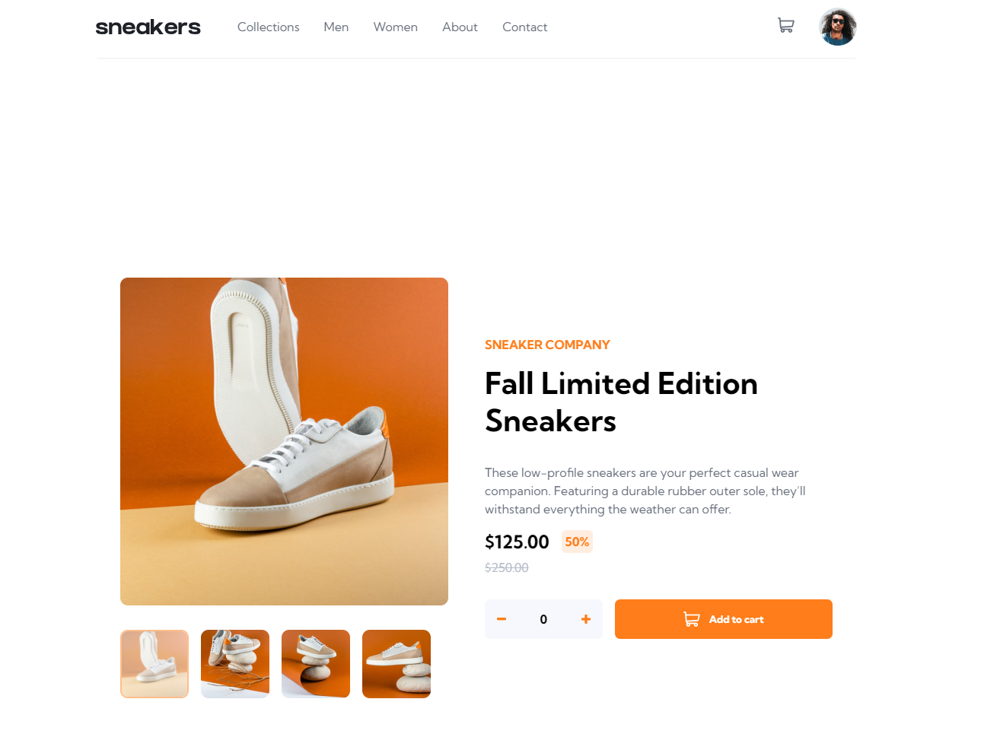

# E Commerce Project 3

# Frontend Mentor - E-Commerce Product Page Solution

This is a solution to the [E-commerce product page challenge on Frontend Mentor](https://www.frontendmentor.io/challenges/ecommerce-product-page-UPsZ9MJp6). Frontend Mentor challenges help you improve your coding skills by building realistic projects.

## Table of contents

- [Overview](#overview)
  - [The challenge](#the-challenge)
  - [Screenshot](#screenshot)
  - [Links](#links)
- [My process](#my-process)
  - [Built with](#built-with)
  - [What I learned](#what-i-learned)
  - [Continued development](#continued-development)
  - [Useful resources](#useful-resources)
- [Author](#author)
- [Acknowledgments](#acknowledgments)

## Overview

### The challenge

Users should be able to:

- View the optimal layout for the site depending on their device's screen size
- See hover states for all interactive elements on the page
- Open a lightbox gallery by clicking on the large product image
- Switch the large product image by clicking on the small thumbnail images
- Add items to the cart
- View the cart and remove items from it

### Screenshot

### Links

- Solution URL: (https://github.com/codewithace-Asher/E-Commerce-Project-3)
- Live Site URL: (https://codewithace-asher.github.io/E-Commerce-Project-3.github.io/)

## My process

- Create Nav 
- Contents and partial function for the "Cart"
- Create Main Content using Flex Options
- Lightbox content created

- Style CSS

- Queryselectors
- Create functions / eventlisteners 

### Built with

- HTML
- CSS
- JS

### What I learned

- The challenge for myself was making sure all my JS functions worked correctly , and worked in order. With many failed attempts and video tutorials 
i have managed to accomplish this task.

### Useful resources

- [Resource 1 - developer.mozilla.org](https://developer.mozilla.org/en-US/docs/Learn/CSS) - This helped me for for the little pieces of code I had trouble with .
- [Resource 2 - learningpeopleapac.percipio.com](https://learningpeopleapac.percipio.com/) - This is an amazing resource helpoed me build a strong foundation with my coding journey.

## Author

- Website - [codewithace](https://https://github.com/codewithace-Asher)

